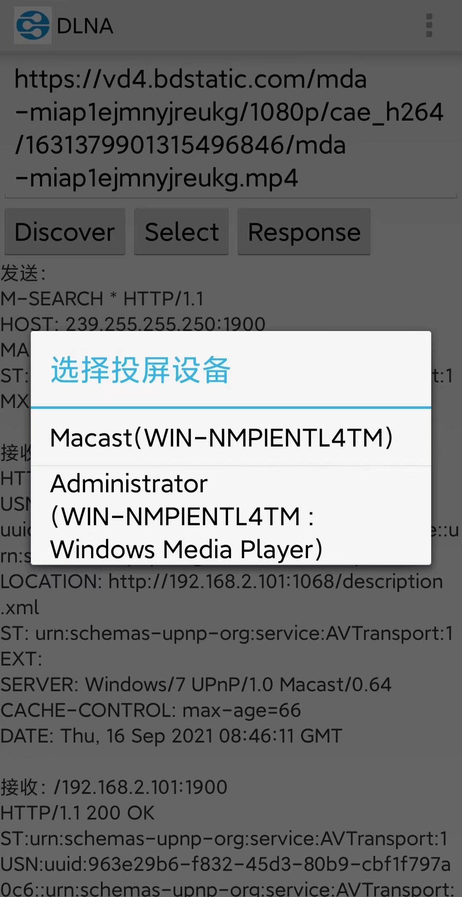

# HTYDLNA_Android
A mini DLNA sender, can not receive yet.  

## Test
| Soft | Support | Status |
|:----:|:----:|:----:|
| [Macast](https://github.com/xfangfang/Macast) | V | Fast |
| [极光TV](https://tv.qq.com) | V | Fast |
| [奇异果TV](http://app.iqiyi.com/tv/player) | V | Fast |
| [酷喵TV](https://www.youku.com) | X | |
| [乐播](https://www.lebo.cn) | X | SDK |
| Kodi | X | Occasionally|

## Reference
https://github.com/sonichy/HTYDLNA